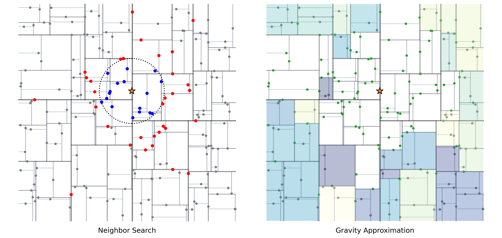

Theory
======

SPH Approximation
-----------------

The key idea of the smoothed particle hydrodynamics (SPH) method is to approximate any field :math:`f(x)` using a smoothing kernel :math:`W(r)`,

.. math::

  \begin{array}{l} \left \langle f(x) \right \rangle = \int_{\Omega} f(x')W(x-x',h)dx' \end{array}

where :math:`h` is the smoothing length.

Replacing the integral with the sum over all particles, the SPH interpolant is discretized as,

.. math::

  \begin{array}{l} \left \langle f(x_i) \right \rangle = \sum_j \frac{m_j}{\rho_j} f(x_j) W_{ij} \end{array}

Similarly, the gradient can be approximated as,

.. math::

  \begin{array}{l} \left \langle \nabla \cdot f(x_i) \right \rangle = \sum_j \frac{m_j}{\rho_j} f(x_j) \cdot \nabla_i W_{ij} \end{array}

The cubic B-spline M4 function has been widely used as the smoothing kernel in the astrophsical SPH community, which is also adopted in the code,

.. math::

  W(r) = \frac{1}{6} \alpha_d \times \left\{\begin{array}{ll} 4-6r^2+3r^3, & 0\leq r<1 \\ (2-r)^3, & 1\leq r \leq 2\\ 0, & r>2 \end{array}\right.

where :math:`r=\left \| x_i-x_j \right \| /h`, and :math:`\alpha_d=3/(2\pi h^3)` in the 3-dimensional case.

.. Note::

  Suppose a simple cubic distribution with mean particle spacing of :math:`\Delta x`, 
  the initial smoothing length is taken as :math:`h=1.2\Delta x` in the code. 
  The particle radius is thus :math:`2.4\Delta x` for the M4 kernel here. 
  Therefore, each SPH particle has ~57 neighbor particles.

Lagrange Equations
------------------

The Lagrange equations describle the conservation of mass, momentum, and energy,

.. math::

  \left\{\begin{array}{l}
    \dot{\rho} + \rho(\nabla\cdot v) = 0 \\
    \dot{v} = \frac{1}{\rho} (\nabla \cdot \sigma) +g \\
    \dot{e} = \frac{1}{\rho} (\sigma : \dot{\epsilon})
  \end{array}\right.

where :math:`\sigma=-pI+s` is the stress tensor, and :math:`\dot{\epsilon}=\frac{1}{2} ((\nabla v)^\top + \nabla v)` is the strain rate.

The equations are then discretized into SPH formulations,

.. math:: 

  \left\{\begin{array}{l}
    \frac{\mathrm{d} \rho_i}{\mathrm{d} t} = \rho_i \sum_j \frac{m_j}{\rho_j} (v_{ij}) \cdot \nabla_i W_{ij} \\
    \frac{\mathrm{d} v_i}{\mathrm{d} t} = \sum_j m_j \left(\frac{\sigma_i}{\rho^2_i} + \frac{\sigma_j}{\rho^2_j} -
        \Pi_{ij}I + \zeta_{ij} \right) \cdot \nabla_i W_{ij} \\
    \frac{\mathrm{d} e_i}{\mathrm{d} t} = \frac{1}{2} \sum_j m_j \left(\frac{p_i}{\rho^2_i} + \frac{p_j}{\rho^2_j} + \Pi_{ij} \right) 
        v_{ij} \cdot \nabla_i W_{ij} + \frac{1}{\rho_i} s_i:\dot{\epsilon}_i
  \end{array}\right.

where :math:`v_{ij}=v_i-v_j`. :math:`\Pi_{ij}` and :math:`\zeta_{ij}` are artificial terms.

Artificial Terms
----------------

Artificial Viscosity
^^^^^^^^^^^^^^^^^^^^

The standard artificial viscosity :math:`\Pi_{ij}` is introduced to handle shocks in SPH, such as particle interpenetration and unphysical oscillations in the pressure field after the shock wave passes,

.. math::

  \Pi_{ij} = \left\{\begin{array}{ll}
    \frac{-\alpha_\Pi \bar{c}_{ij} \phi_{ij} + \beta_\Pi \phi^2_{ij}}{\bar{\rho}_{ij}} , & v_{ij} \cdot x_{ij} < 0 \\
    0, & v_{ij} \cdot x_{ij} \geq 0 \end{array}\right.

where

.. math::

  \begin{array}{l} \phi_{ij} = \frac{\bar{h}_{ij}v_{ij} \cdot x_{ij}}{\left\| x_{ij} \right\|^2 + 0.1 \bar{h}^2_{ij}} \end{array}

Artificial Stress
^^^^^^^^^^^^^^^^^

The artificial stress :math:`\zeta_{ij}` is implemented to suppress the possible tensile instability that leads to numerical clumping of particles,

.. math::

  \begin{array}{l} \zeta_{ij} = (\zeta_i+\zeta_j) \left(\frac{W(x_{ij})}{W(\Delta x)}\right)^4 \end{array}

where :math:`\Delta x` is the mean particle spacing, and the tensor :math:`\zeta_i` represents a local measure of tension in principal axes of the stress :math:`\sigma_i`,

.. math::

  \begin{array}{l} \zeta_i = -0.2\frac{1}{\rho^2_i} U \mathrm{diag}\left(\max(\sigma_i^A,0), \max(\sigma_i^B,0), \max(\sigma_i^C,0)\right) U^\top \end{array}

with the eigendecomposition of :math:`\sigma_i` as :math:`U\mathrm{diag}(\sigma_i^A,\sigma_i^B,\sigma_i^C)U^\top`.

Correction Tensor
^^^^^^^^^^^^^^^^^

The correction tensor :math:`C_i` is used to increase the consistency of velocity gradient to the first order, in order to conserve the angular momentum of the particle system. The corrected velocity gradient is then,

.. math::

  \begin{array}{l} \nabla v_i = \sum_j \frac{m_j}{\rho_j} v_{ij} \otimes (C_i \nabla_i W_{ij}) \end{array}

where the correction tensor is given by,

.. math::

  \begin{array}{l} C_i = \left( -\sum_j \frac{m_j}{\rho_j} x_{ij} \otimes \nabla_i W_{ij} \right)^{-1} \end{array}

XSPH
^^^^

The XSPH term is optional to apply an averaged speed smoothed by the velocity of neighbor particles. The equation of motion is then modified as,

.. math::

  \begin{array}{l} \frac{\mathrm{d} x_i}{\mathrm{d} t} = v_i - 0.5 \sum_j \frac{m_j}{\bar{\rho}_{ij}} v_{ij} W_{ij} \end{array}

Nothe that the linear and angular momentum are still conserved exactly when using the XSPH correction.

Strength Model
--------------

The elastic perfectly plastic mdoel is used the update the deviatoric stress tensor :math:`s`. The Hooke's law describes the linear elastic behavior of solid materials as,

.. math::

  \begin{array}{l} \frac{\mathrm{d} s}{\mathrm{d} t} = 2G\left( \dot{\epsilon} - \frac{1}{3}\mathrm{Tr}(\dot{\epsilon})I \right) + s\dot{R}^\top + \dot{R}s \end{array}

where :math:`G` is the shear modulus, :math:`\dot{R}=\frac{1}{2} ((\nabla v)^\top - \nabla v)` is the rotation rate. The yielding criterion is then introduced to model plasticity, with the deviatoric stress limited by, 

.. math:: s'=fs

Von Mises Yield Criterion
^^^^^^^^^^^^^^^^^^^^^^^^^

In the simple Von Mises yield criterion, the factor :math:`f` is computed as 

.. math::

  \begin{array}{l} f=\min\left(Y_0/\sqrt{\frac{3}{2}s:s}, 1\right) \end{array}

where :math:`Y_0` is the material yield strengh.

Drucker-Prager Yield Criterion
^^^^^^^^^^^^^^^^^^^^^^^^^^^^^^

A more general pressure-dependent yield criterion is to use the Drucker-Prager model. And the yield strength is given by,

.. math::

  \left\{\begin{array}{l}  Y_i=Y_0+\frac{\mu_i p}{1+\mu_i p/(Y_m-Y_0)} \\ Y_d=\mu_d p \end{array}\right.

where :math:`Y_0` is the cohesion at zero pressure, :math:`Y_m` is the strength limit, and :math:`\mu` is the coefficient of internal friction. The subscripts ``i`` and ``d`` here denote intact and damaged respectively. For partially damaged material, the yield strength is interpolated according to the scalar damage :math:`D`,

.. math:: Y=(1-D)Y_i+DY_d

Damage and Fragmentation
------------------------

The Grady-Kipp scalar damage :math:`D\in[0,1]` is introduced to represent the degree of fragmentation, with :math:`D=0` being intact, and :math:`D=1` being fully fractured. The failure of solid material leads to a reduction of its strength in tension and shear deformation. The pressure and deviatoric stress are then modified by,

.. math::

  \left\{\begin{array}{l} p' = p>0 \ ?\ p:(1-D)p \\ s'=(1-D)s \end{array}\right.

The Weibull distribution is commonly used to describe the number of flaws per unit volume with  activation threshold lower than :math:`\epsilon`, following :math:`n(\epsilon)=k\epsilon^m`. With the particle strain measured as a scalar,

.. math::

  \begin{array}{l} \epsilon_i=\frac{max(\sigma^A_i,\sigma^B_i,\sigma^C_i)}{(1-D_i)E} \end{array}

where :math:`E` is the elastic modulus, the damage growth is obtained by,

.. math::

  \begin{array}{l} \frac{\mathrm{d} D^{1/3}_i}{\mathrm{d} t} = n_{\mathrm{act}} \frac{c_g}{R_i} \end{array}

where :math:`n_{\mathrm{act}}` is the number of active flaws inside the particle, :math:`c_g=0.4c_s` is the speed of crack growth, and :math:`R_i` is the particle radius.

The fracture area :math:`A_i` is integrated until fully damaged,

.. math::

  \begin{array}{l} \frac{\mathrm{d} A_i}{\mathrm{d} t} = \frac{(m+2)(m+3)}{2c_g} \left(\frac{8\pi c_g^3 k}{(m+1)(m+2)(m+3)}\right)^{2/3} \epsilon^{2m/3}_i D^{1/3}_i \end{array}

The most frequent :math:`L_m` and the largest :math:`L_\max` of the fragment size distribution are calculated as

.. math::

  \begin{array}{l} L_m=\frac{3(m+3)}{(m+2)}\frac{1}{A_i} , & L_\max=\frac{m+2}{3}L_m \end{array}

The cumulative number of fragments larger than a given size :math:`L` inside a particle is then given by,

.. math::

  \begin{array}{c} F_{\mathrm{cum}}^i(L) = \frac{(m+6)(m+5)(m+4)}{120}\frac{V_{\mathrm{cell}}}{L_{\max}^3}\left(1-\frac{L}{L_{\max}}\right)^m\left[1+m\left(\frac{L}{L_{\max}}\right)\right. \\
      \left.+\frac{m(m+1)}{2}\left(\frac{L}{L_{\max}}\right)^2+\frac{m(m+1)(m+2)}{6}\left(\frac{L}{L_{\max}}\right)^3\right] \end{array}

Equation of State
-----------------

Tillotson EOS
^^^^^^^^^^^^^

The commonly used Tillotson equation is designed to duplicate the linear shock-particle velocity relation at low pressures and to extrapolate to the Thomas-Fermi limit at high pressures.

For compressed states, or cold expanded states with the specific energy less than the energy of incipient vaporization :math:`e<e_{iv}`, the pressure :math:`p_c` is obtained by,

.. math::

  \begin{array}{l} p_c = \left[a + \frac{b}{1+e/(e_0\eta^2)} \right] \rho e + A\mu  + B\mu^2 \end{array}

where :math:`a`, :math:`b`, :math:`A`, :math:`B`, :math:`e_0` are Tillotson parameters, :math:`\eta=\rho/\rho_0`, :math:`\mu=\eta-1`, and :math:`\nu=1/\eta-1`.

For hot expanded states with :math:`e>e_{cv}` exceeding the complete vaporization energy, the pressure :math:`p_e` is,

.. math::

  \begin{array}{l} p_e = a\rho e + \left[\frac{b\rho e}{1+e/(e_0\eta^2)} + A\mu\exp(-\beta\nu) \right] \exp(-\alpha \nu^2) \end{array}

The pressure in a partial vaporization regime is given by the linear interpolation of both phases as,

.. math::

  \begin{array}{l} p = \frac{p_e(e-e_{iv}) + p_c(e_{cv}-e)}{e_{cv}-e_{iv}} \end{array}

P-alpha Porosity
^^^^^^^^^^^^^^^^

The pressure in porous materials is given by the pressure in the solid material :math:`p_s` divided by the distension :math:`\alpha`,

.. math::

  \begin{array}{l} p = \frac{1}{\alpha} p_s(\rho_s, e_s) = \frac{1}{\alpha} p_s(\alpha\rho, e) \end{array}

In the p-alpha model, the distension :math:`\alpha` is a function of the pressure,

.. math::

  \alpha = \left\{\begin{array}{ll} \alpha_0, & p \leq p_e \\ 1+(\alpha_0-1)\left(\frac{p_s-p}{p_s-p_e}\right)^2, & p_e < p < p_s \\ 1, & p \geq p_s \end{array}\right.

where :math:`p_e` and :math:`p_s` represent the pressure constants at elastic and solid states.

K-d Tree
--------

The binary k-d tree is implemented to search for neighbors within the particle radius for SPH interpolation. Starting from the root node, each tree node includes one SPH particle and two child nodes that are spilted by a hyperplane. Note that the computational complexity is :math:`\mathcal{O}(n\log n)` both for constructing a balanced k-d tree and for finding all pairs of neighbor particles using the tree.

When considering self-gravity, the monopole and quadpole terms are also calculated for the same tree nodes. The Barnes-Hut algorithm is then used to approximate the gravitational forces between all particles, with the criterion given by,

.. math::

  \begin{array}{l} \frac{l_n}{r} < \theta \end{array}

where :math:`l_n` is the edge length of the node, :math:`r` is the distance between a SPH particle and the node, and :math:`\theta` is the open angle. In that case, the node's gravitational force acting on the SPH particle can be approximated as a point mass at the node's center of mass.

Gravitational Softening
^^^^^^^^^^^^^^^^^^^^

The gravitational softening kernel :math:`\phi(r,h)` is necessary to correct the inter-particle gravitational forces, and should match the above M4 kernel. The radial derivative :math:`\phi'(r,h)` is given by,

.. math::

  \phi'(r, h) =
    \left\{\begin{array}{ll}
      \frac{1}{h^{2}}\!\left(\frac{4}{3}r - \frac{6}{5}r^{3} + \frac{1}{2}r^{4}\right), & 0 \le r < 1\\
      \frac{1}{h^{2}}\!\left(\frac{8}{3}r - 3r^{2} + \frac{6}{5}r^{3} - \frac{1}{6}r^{4} - \frac{1}{15r^{2}}\right), & 1 \le r < 2\\
      \frac{1}{(rh)^{2}}, & r \ge 2
    \end{array}\right.

Time Integration
----------------

The second-order leapfrog integration regime is implemented in the code,

.. math::

  \left\{\begin{array}{l} v_{i+\frac{1}{2}} = v_{i}+a_{i}{\frac {\Delta t}{2}} \\
      x_{i+1} = x_{i}+v_{i+\frac{1}{2}}\Delta t \\
      v_{i+1} = v_{i+\frac{1}{2}}+a_{i+1}{\frac {\Delta t}{2}} \end{array}\right.

where the timestep :math:`\Delta t` is determined by the Courant-Friedrichs-Lewy (CFL) condition,

.. math::

  \begin{array}{l} \Delta t = \min_i \left(\frac{0.2 h_i}{c_s + \|v_i\|} \right) \end{array}

